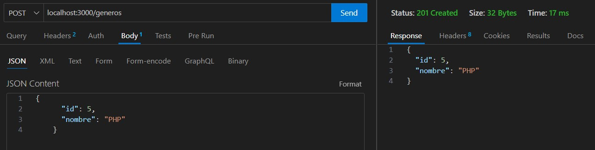
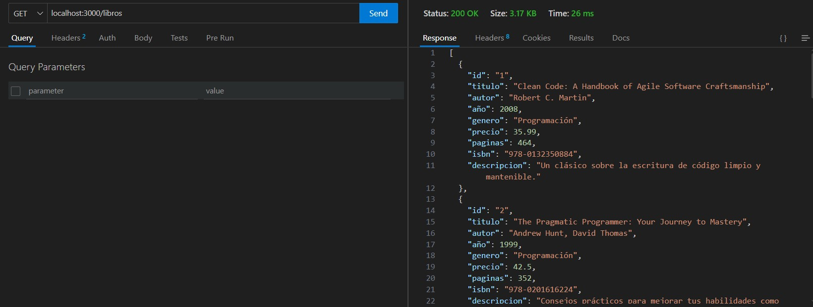
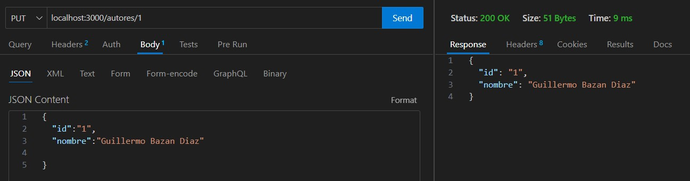
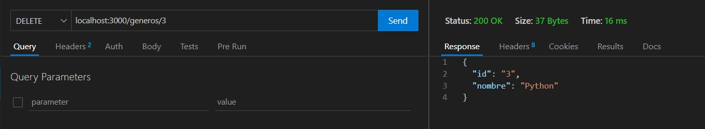
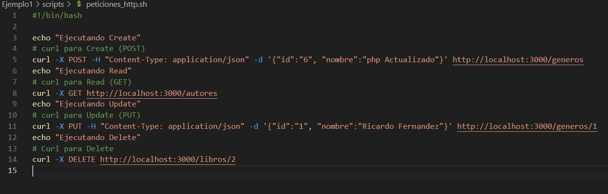
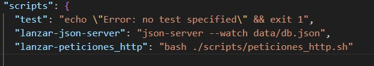
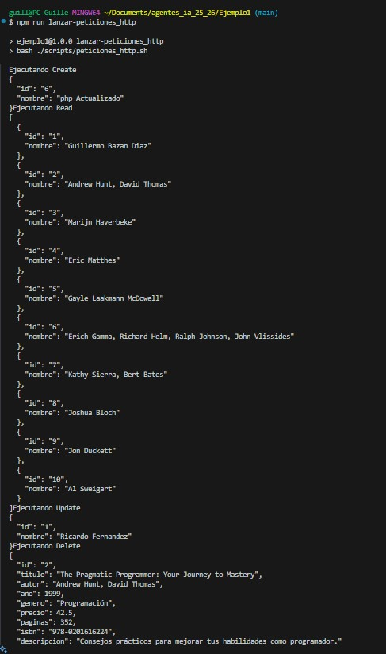

# Cecklist CRUD

## Thunder Client

- [x] **Tener instalada la extension Thunder Client en VS**
- [x] **Crear nueva solicitud de GET (create)**
.
- [x] **Crear nueva solicitud de POST (read)**
.
- [x] **Crear nueva solicitud de put (update)**
.
- [x] **Crear nueva solicitud de DELETE (delete)**
.

## Script peticiones_http.sh

- [x] **Crear el archivo de script en la carpeta correspondiente**
- [x] **Crear el script para que lance las peticiones CRUD**

- [x] **Añadir a package.json una entrada para lanzar el script**

- [x] **Script funciona sin problemas**
