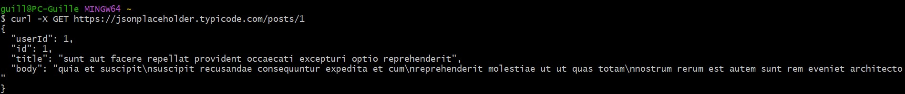
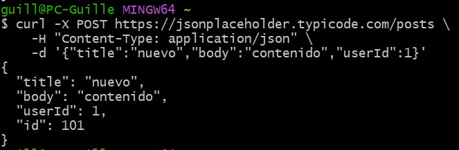
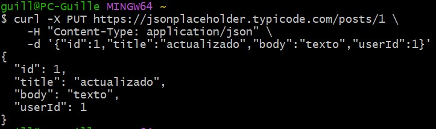
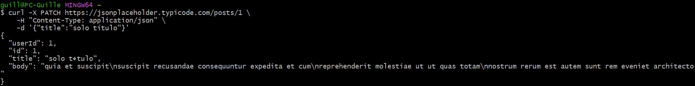
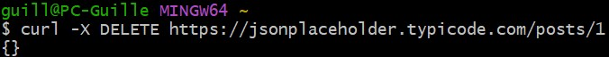
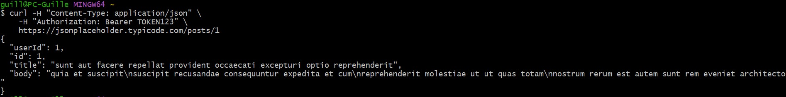
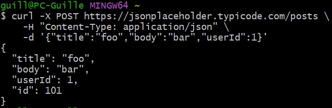
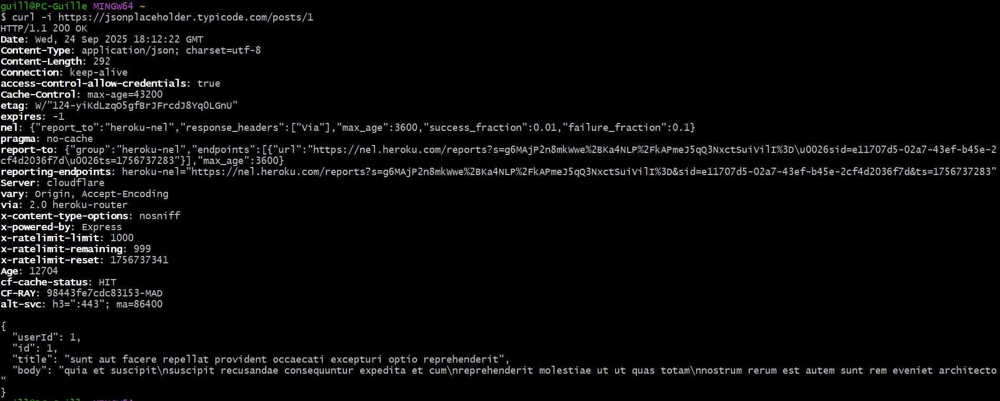
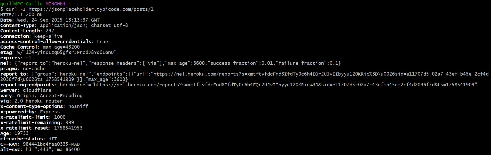

# Tarea CURL

- Crear un documento que ejemplifique todas las posibles opciones del comando curl
- Usar alguna web fake rest api para probar las posibles funcionalidades del comando curl
- Crear /scripts/test.sh que lance todas los posibles test del comando curl para realizar GET, POST, DELETE, PUT, PATCH

# Manual curl


## Metodos http (-X)

- La opción -X indica el método HTTP (GET, POST, PUT, PATCH, DELETE). Si no se especifica ninguno por defecto se usa GET.
- Sirven para definir qué tipo de operación quieres hacer sobre un recurso.
</br>

- GET: Sirve para obtener un recurso.

```bash
    curl -X GET https://jsonplaceholder.typicode.com/posts/1
```

</br>

- POST: Sirve para crear un nuevo recurso.

```bash
    curl -X POST https://jsonplaceholder.typicode.com/posts \
    -H "Content-Type: application/json" \
    -d '{"title":"nuevo","body":"contenido","userId":1}'
```

- -H le indica al servidor el tipo de petición. En este caso se especifica que es de tipo json.

- -d sirve para especificar los datos que se van a enviar. Si no se pone esta opción, la petición se enviará sin cuerpo.

</br>
- PUT: Sirve para reemplazar por completo un recurso existente.

```bash
    curl -X PUT https://jsonplaceholder.typicode.com/posts/1 \
    -H "Content-Type: application/json" \
    -d '{"id":1,"title":"actualizado","body":"texto","userId":1}'
```

<br>
- PATCH: Sirve para modificar parcialmente un recurso existente.

```bash
    curl -X PATCH https://jsonplaceholder.typicode.com/posts/1 \
    -H "Content-Type: application/json" \
    -d '{"title":"solo título"}'
```

</br>
- DELETE: Sirve para eliminar un recurso.

```bash
    curl -X DELETE https://jsonplaceholder.typicode.com/posts/1
```

</br>

## Headers (-H)

- -H sirve para agregar cabeceras HTTP personalizadas. Es útil para indicar el tipo de contenido (JSON, XML, etc.) o para enviar información como tokens de autorización.

```bash
    curl -H "Content-Type: application/json" \
    -H "Authorization: Bearer TOKEN123" \
    https://jsonplaceholder.typicode.com/posts/1
```

</br>

## Enviar datos (-d o --data)

- -d (--data) envía datos en el body de la petición. Normalmente se usa con POST, PUT o PATCH. Combinado con el header permite enviar datos del tipo especificado en el header (JSON, XML, etc.).

```bash
    curl -X POST https://jsonplaceholder.typicode.com/posts \
    -H "Content-Type: application/json" \
    -d '{"title":"foo","body":"bar","userId":1}'
```

</br>

## Ver header de respuesta (-i, -I)

- -i incluye los header de respuesta junto al body. -I hace una petición HEAD que solo devuelve los headers sin incluir el body.

Headers + body:

```bash
    curl -i https://jsonplaceholder.typicode.com/posts/1
```

</br>
Solo headers:

```bash
    curl -I https://jsonplaceholder.typicode.com/posts/1
```
